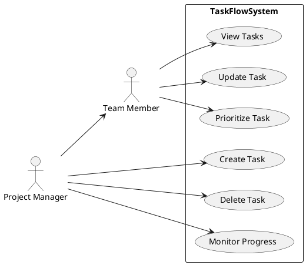
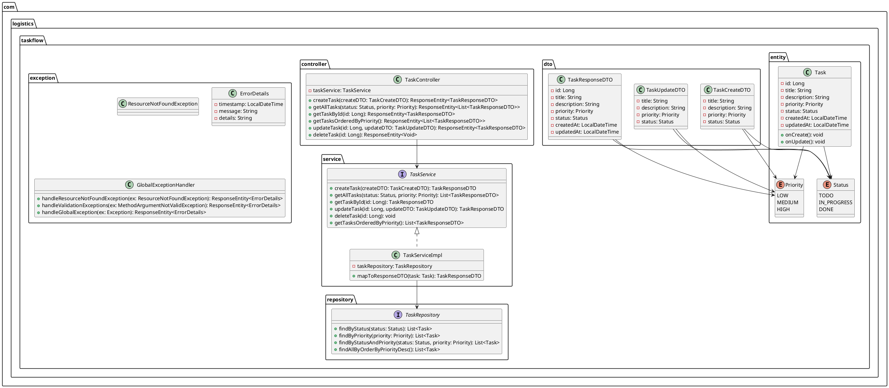

# TaskFlow: Software Engineering & Agile Academic Report

**Course**: Advanced Software Engineering and Agile Systems  
**Project Name**: TaskFlow - Agile Task Management System  
**Role**: Senior Software Engineer / Software Architect / Scrum Master  

---

## 1. Executive Summary & Project Description
In the fast-paced logistics industry, operations require high-performance tracking mechanisms to prevent supply chain bottlenecks. General task lists are insufficient; teams need to manage tasks dynamically based on high-priority cargo, routes, and personnel allocation.

**TaskFlow** is a complete, production-grade backend task management CRUD system designed for a fictional logistics startup. It enables team members to organize daily activities and provides managers with total overview visibility over shipping, warehousing, and delivery status tracking. The application is built using a modern **Spring Boot 3 + Java 17** stack, relying on JSR-380 validation, JpaRepository auditing, standard HTTP routing, and clean MVC/SOLID architecture design.

---

## 2. Importance of Software Engineering & Agile Principles
Software Engineering is the systematic application of engineering principles to software development. In this project, applying rigorous practices yields:
*   **Maintainability**: Separation of concerns ensures that database schema modifications do not break HTTP presentation controllers.
*   **Reliability**: Automated testing pipelines verify changes before execution, protecting operations.
*   **Predictability**: Adherence to semantic versioning and semantic commits ensures clean teamwork tracking.

Agile Development, implemented via **Scrum** and **Kanban**, addresses startup volatility. Instead of rigid upfront specifications, the team builds working increments, receives immediate feedback, and adapts the backlog cards based on real-world constraints.

---

## 3. Initial Scope vs. Scope Change
*   **Initial Milestone**: Build a standard CRUD pipeline for tasks containing an ID, title, description, and status state (`TODO`, `IN_PROGRESS`, `DONE`).
*   **Scope Change Request**: The client requested a feature to flag and sort tasks by **Priority** (`LOW`, `MEDIUM`, `HIGH`) to identify high-urgency shipments (e.g. perishable food, urgent medicine).
*   **Agile Response**: We analyzed the scope change, mapped database migration impact, updated our sprint backlog, and implemented a custom JPA sorting method (`findAllByOrderByPriorityDesc()`), demonstrating agile resilience without delaying the delivery schedule.

---

## 4. UML Documentation

### A) Use Case Diagram Description
The TaskFlow system maps interactions for two main user roles (Actors):
*   **Team Member**: Primarily executes daily logistics. They can view tasks, update status, and prioritize tasks they are assigned to.
*   **Project Manager**: Oversees administrative metrics. In addition to team operations, they have privileges to create and delete tasks, and monitor overall system progress.

#### Use Case Diagram (PlantUML)


---

### B) Class Diagram Description
The backend utilizes a multi-layered Architecture pattern:
1.  **Presentation layer (`controller`)**: Interfaces HTTP requests, parses payloads, maps exceptions.
2.  **DTO layer (`dto`)**: Decouples database entities from API client contracts, securing fields.
3.  **Service layer (`service`)**: Contains business rules, handles transactions.
4.  **Data Access layer (`repository`)**: Extends Spring Data `JpaRepository` to run SQL operations on H2 Database.
5.  **Domain model (`entity`)**: Represents persistence schemas (`Task`, `Priority`, `Status`).

#### Class Diagram (PlantUML)


---

## 5. Automated Testing & Verification
Quality Assurance is achieved through two complementary testing strategies:
1.  **Isolated Unit Tests (`TaskServiceTest`)**: We mock the repository layer using Mockito. This ensures the service class is tested in total isolation, confirming that business validations, dates, and exception throws work properly.
2.  **Web Layer Slice Tests (`TaskControllerTest`)**: Using Spring's `@WebMvcTest` and MockMvc, we test HTTP serialization, routing, validation behaviors (e.g. empty JSON strings returning a `400 Bad Request`), and REST contracts without initializing the full database context.

---

## 6. DevOps & Continuous Integration (CI)
To guarantee a "fail-fast" pipeline, we configured **GitHub Actions** (`.github/workflows/maven.yml`). 

```
[Developer Push / PR]
       │
       ▼
┌───────────────────────────────┐
│ GitHub Actions Runner triggers│
└──────────────┬────────────────┘
               │
               ▼
┌───────────────────────────────┐
│ Checkout Code base            │
└──────────────┬────────────────┘
               │
               ▼
┌───────────────────────────────┐
│ Install JDK 17 (Temurin)      │
└──────────────┬────────────────┘
               │
               ▼
┌───────────────────────────────┐
│ Restore cached Maven files    │
└──────────────┬────────────────┘
               │
               ▼
┌───────────────────────────────┐
│ Compile code & run JUnit tests│
└──────────────┬────────────────┘
               │
               ▼
   [Success / Failure Report]
```
On every commit/PR, the runner:
1. Check out the latest code version.
2. Initializes Java 17.
3. Restores cache directories for Maven.
4. Executes `mvn verify` to build and test. If a developer breaks a validation test, the CI build fails immediately, keeping the main deployment branch stable.

---

## 7. Conclusion
TaskFlow represents a successful deployment of Modern Software Engineering practices in a startup framework. Separating components using clean interfaces, protecting domain rules through validation DTOs, and automating builds via CI pipelines ensures high quality, adaptability to scope changes, and quick releases.
